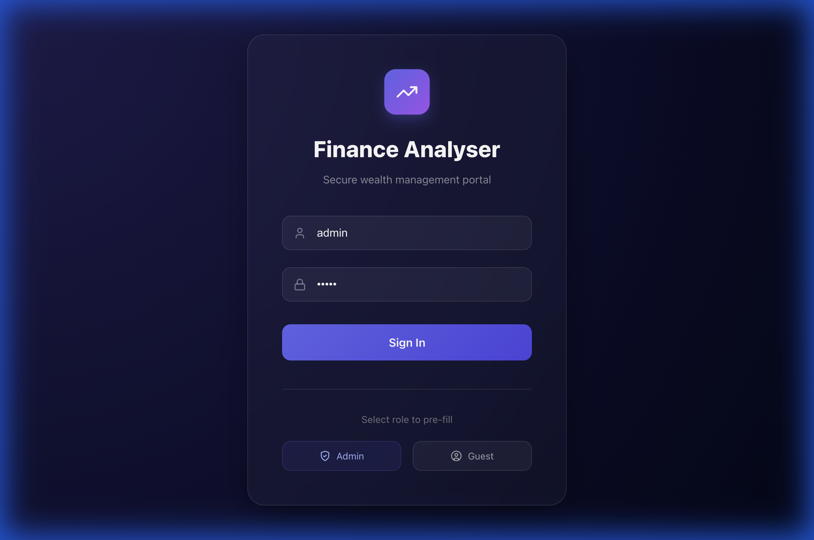
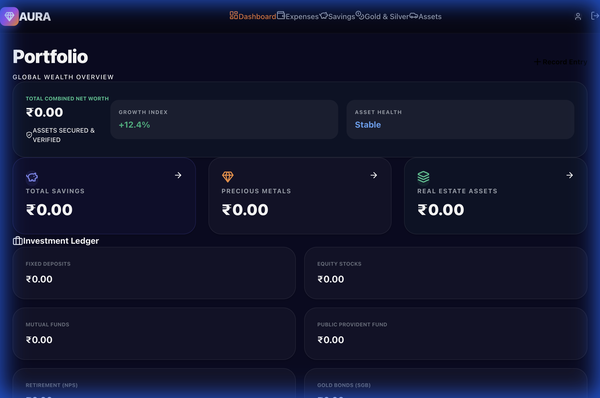
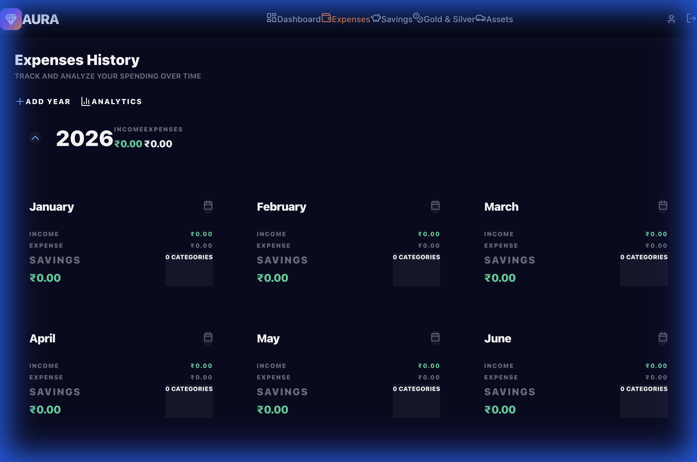
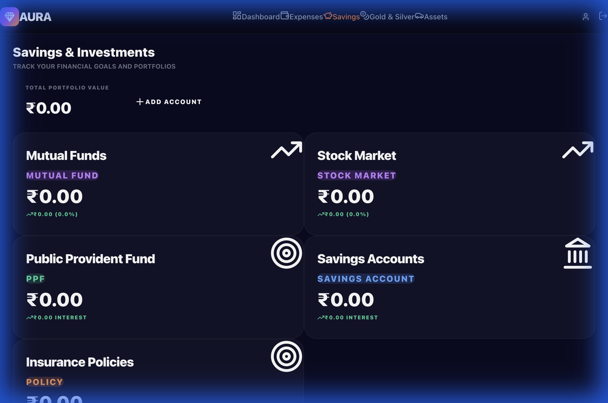
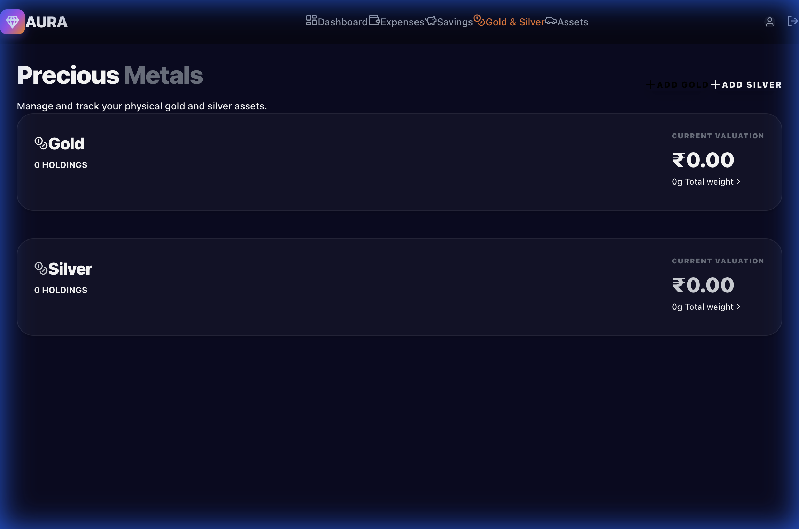
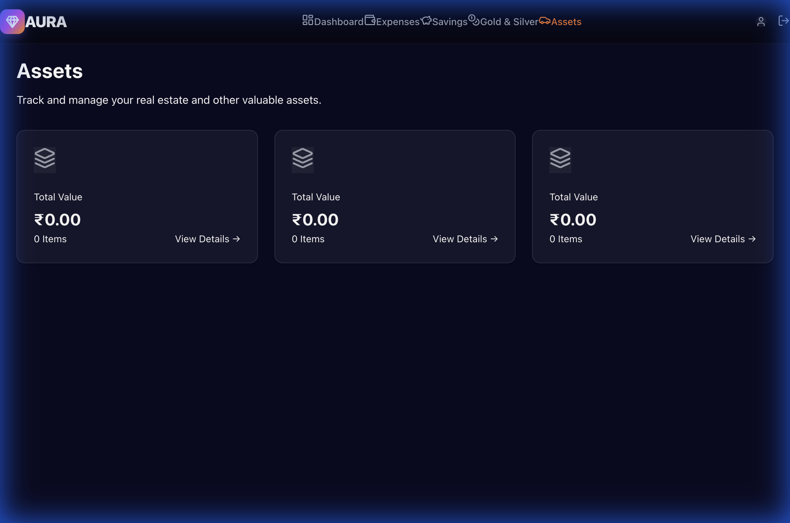
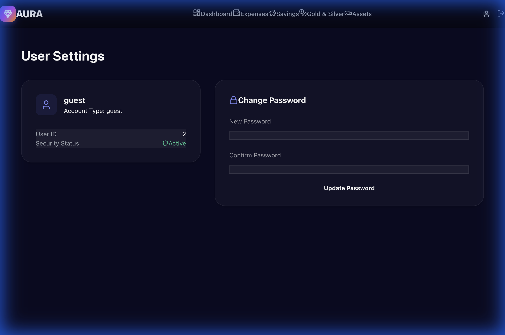

# Aura Finance - Personal Wealth Tracker

Aura Finance is a premium, secure, and highly visual financial dashboard designed to track expenses, savings, precious metals, and real estate assets in one place.

## Features

- **Personal Ledger**: Comprehensive tracking of monthly expenses with categorical analysis.
- **Investment Portfolio**: Track Mutual Funds, Fixed Deposits, Stocks, PPF, NPS, and more.
- **Precious Metals**: Monitor Physical Gold and Silver holdings with live market valuation.
- **Real Estate & Assets**: Manage property and asset values.
- **Stock Market Auto-Fetch**: Real-time stock price updates via Yahoo Finance API.
- **Role-Based Access**: 
  - **Admin**: Full access to the private financial database.
  - **Guest**: View-only layout mode (data remains private).

## Application Tour

### 1. Secure Login
Every database is protected by a login wall. Users can log in as an Admin to manage their data or as a Guest to explore the application's layout without exposing private information.



### 2. Global Wealth Dashboard
The Dashboard provides a high-level overview of your entire net worth, aggregating data from all investment categories and physical assets into a single "Portfolio" view.



### 3. Expenses History
Track your spending patterns across years and months. In Guest mode, the application automatically populates the current year and all 12 months with zeroed-out structures, giving you a full preview of the tracking capability.



### 4. Savings & Investments
A central hub for all your financial instruments. Guest mode displays blank placeholder cards for:
- **Mutual Funds**
- **Stock Market**
- **Public Provident Fund (PPF)**
- **Savings Accounts**
- **Insurance Policies**



### 5. Precious Metals
A specialized view for gold and silver holdings. Calculate current value based on weight and contemporary market rates.



### 6. Real Estate Assets
Manage plots, apartments, and other high-value assets with purchase and current value tracking. Guest mode provides detailed sections for **Plots**, **Apartments**, and **Other Assets**.



### 7. User Profile
Manage your account security and update your credentials anytime.



---

## Technical Stack

- **Frontend**: React.js with Vite
- **Styling**: Vanilla CSS with modern Glassmorphism aesthetics
- **Icons**: Lucide React
- **Backend/Database**: JSON Server
- **APIs**: Yahoo Finance (via CORS Proxy)

## Getting Started

1. **Install Dependencies**:
   ```bash
   npm install
   ```

2. **Run the Backend Server**:
   ```bash
   npm run server
   ```

   ```

3. **Run the Frontend Application**:
   (Open a new terminal window/tab)
   ```bash
   npm run dev
   ```

4. **Login Credentials**:
   - **Admin**: `admin` / `admin`
   - **Guest**: `guest` / `guest`